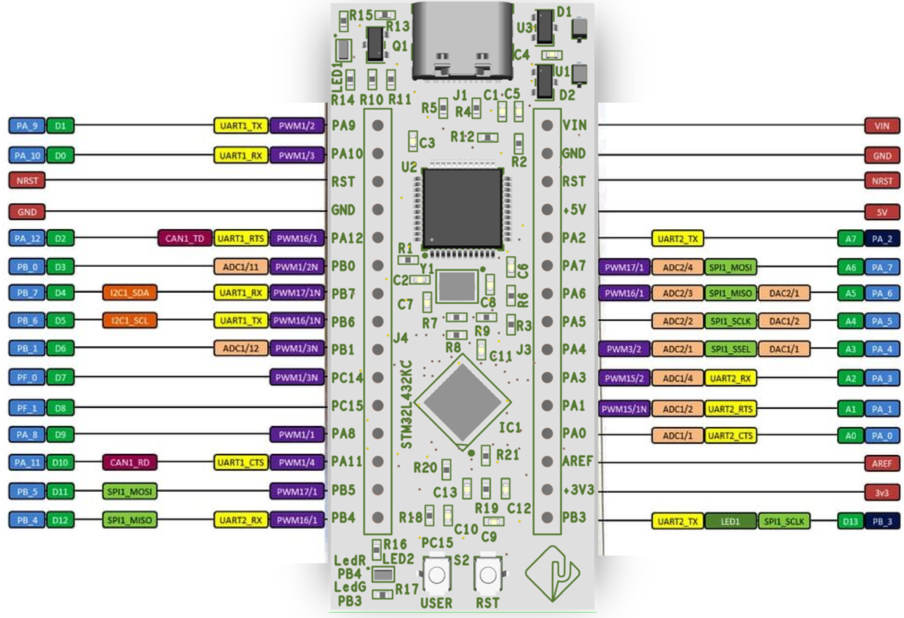

# Présentation de la carte MuCLEO L432KC (clone de la Nucleo)

<div align="center">
  
  <p><em>Pinout L432KC</em></p>
</div>

## 🔧 **Introduction**
Ce dépôt propose une série de projets d’exemple destinés à la carte **Nucleo L432KC**. Chaque répertoire contient un projet STM32CubeIDE complet ainsi qu'un sous-répertoire `bin/` contenant les fichiers binaires prêts à être flashés directement sur la carte.

Ces projets permettent de démontrer diverses fonctionnalités de la carte, telles que la gestion des GPIOs, l’utilisation du PWM, des interruptions, de l’I2C, du SPI, et bien plus encore.

---

## 🔹 **Structure du dépôt**

```
/
├── L432KC_projet_1/                   # Dossier contenant un projet exemple complet
│   ├── .settings/              # Fichiers de configuration STM32CubeIDE
│   ├── Core/                   # Code source du projet (main.c, stm32l4xx_it.c, etc.)
│   ├── Drivers/                # Drivers HAL et CMSIS pour STM32
│   ├── bin/                    # Fichiers binaires prêts à flasher (hex, bin, elf)
│   └── projet_1.ioc            # Fichier de configuration CubeMX
│
├── L432KC_projet_2/                   # Un autre projet exemple
│   └── bin/                    # Fichiers binaires prêts à flasher
│
├── README.md                   # Ce fichier de présentation
└── img/                        # Images et captures d'écran de la configuration
```
Chaque dossier **projet_x** est un projet complet que vous pouvez importer dans **STM32CubeIDE**. Vous y trouverez également un dossier **bin/** contenant les fichiers binaire (".bin", ".hex", ".elf") prêts à être flashés sur la carte.

---

## 🔹 **Comment importer un projet dans STM32CubeIDE ?**

1. Copier le dossier du projet dans votre dossier de workspace
2. **Lancez STM32CubeIDE** et accédez à l'option **File → Import**.
3. Dans la fenêtre qui s’ouvre, choisissez **Existing Projects into Workspace** et cliquez sur **Next**.
4. Cliquez sur **Browse** et sélectionnez le dossier du projet (ég. `projet_1/`).
5. Assurez-vous que le projet est bien coché dans la liste des projets détectés, puis cliquez sur **Finish**.

Vous devriez maintenant voir le projet importé dans l’explorateur de projets de STM32CubeIDE.

---

## 🔹 **Comment flasher directement le fichier binaire ?**

1. **Connectez la carte Nucleo L432KC** à votre PC via le port USB.
2. **Ouvrez STM32CubeProgrammer**.
3. Cliquez sur **Connect** en vérifiant que la carte est bien détectée.
4. Accédez à l’onglet **File Download**, cliquez sur **Browse** et choisissez le fichier binaire à flasher. Ce fichier se trouve dans le dossier `bin/` de chaque projet (ég. `projet_1/bin/projet_1.bin`).
5. Cliquez sur **Download** et patientez jusqu'à la fin du flashage.

Vous pouvez également copier le fichier ".bin" directement dans le lecteur **NUCLEO** qui apparaît comme une clé USB sur votre PC.

---

## 🔹 **Prérequis logiciels**

Avant de commencer, assurez-vous d'avoir installé les logiciels suivants :
- **STM32CubeIDE** : Environnement de développement intégré pour STM32.
- **STM32CubeProgrammer** : Outil de flashage des microcontrôleurs STM32.

Vous pouvez télécharger ces outils depuis le site officiel de **STMicroelectronics**.

---

## 🔹 **Exécution d'un exemple**

1. Importez le projet dans STM32CubeIDE comme expliqué plus haut.
2. Compilez le projet (clic droit « Build Project »).
3. Connectez la carte Nucleo à l’ordinateur.
4. Cliquez sur **Run** pour téléverser le programme et l’exécuter.

Vous pouvez également utiliser le fichier `.bin` du dossier `bin/`.

---
